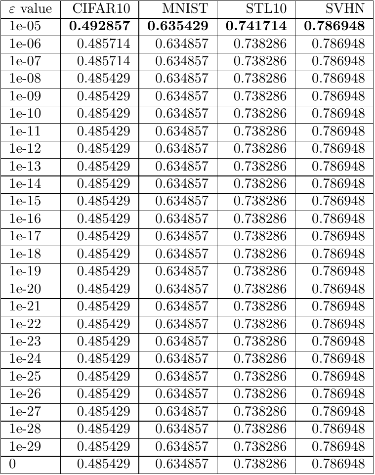
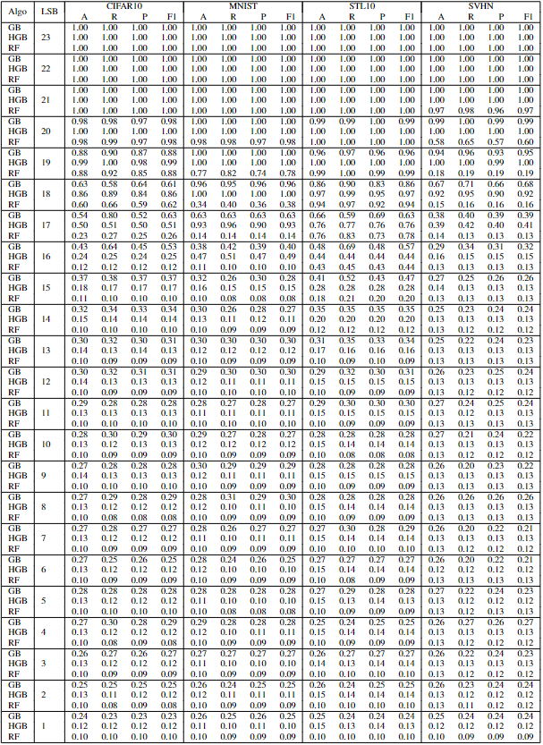

# Experimental Results
This directory holds supplementary table results from unsupervised and supervised experiments in AI Model Steganalysis article.

## Experiment 1 - Mean + epsilon (Accuracy scores for each epsilon we tested)
See LaTeX file [here](exp1_table_scores.tex)  
### Preview

## Experiment 4 (Model Weights) - Including GradientBoosting algorithm
See LaTeX file [here](exp4_table_supervised_weights.tex)  
### Preview

